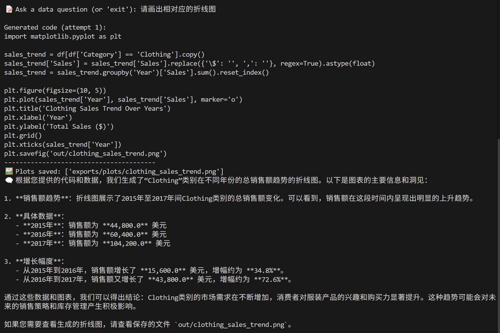

# CSV‑DA

**CSV‑DA (CSV Data‑Analysis assistant)** is a command‑line tool that lets you query any CSV file in *plain language* and receive reliable answers backed by executable Python.

It works by

1. describing the dataset to a Large Language Model (OpenAI GPT‑4o‑mini by default, or any Hugging‑Face chat model(to be implemented));
2. letting the LLM write pandas code;
3. executing that code inside a locked‑down Docker sandbox; and
4. asking the LLM to explain the result in natural language (Chinese by default).

---

**Repo layout**

```text
src/
├─ analysis/            ← data loading & sandbox runners
│   └─ sandbox/
│       ├─ docker/      ← Dockerfile + `sandbox_entry.py`
│       ├─ docker_runner.py
│       └─ local_runner.py
│       └─ sandbox_runner.py      ← auto‑selects docker ↔ local
├─ history/             ← chat history & rotating logger
├─ llm/                 ← model wrapper + prompt builders
├─ config.py            ← runtime settings (env vars)
├─ main.py              ← CLI entry point
└─ __init__.py    

Makefile                ← `make docker` builds sandbox image
requirements.txt        ← Python deps (incl. *docker* SDK)
README.md               ← this file
```

---

**Quick Start**

```bash
cd CSV_DA
```

```bash
# install the package
conda create --name csv_da
conda activate csv_da

# install python deps (incl. docker‑python)
(csv_da) $ pip install -r requirements.txt
```
```bash
# export your openai api key first
export OPENAI_API_KEY="sk-…"
```

## Choose your sandbox flavour
### A) Docker (recommended)
    Gives the strongest isolation.
    Requires Docker daemon running and your user in the docker group

```bash
(csv_da) $ make docker 
(csv_da) $ python -m src.main # you will see:
🐳  Using **Docker** sandbox (image csv_da_sandbox).
```
### B) Local fallback (no Docker available)
    If the Docker daemon is missing, stopped, or the Python docker SDK cannot ping it, CSV‑DA automatically switches to a lightweight runner.
    Executes user code in a temporary folder.
```bash
(csv_da) $ python -m src.main # you will see:
⚠️  Docker not available → using **LOCAL** sandbox (limited isolation).
```
# run the CLI
python -m src.main


**Steps**
*step1: enter the csv file that you want to analyze*<br>


*step2: Ask questions in natural language – the assistant writes & executes code, then explains the result.*


*step3(optional): you can also try to ask the asistant to draw a hist plot for you!*

