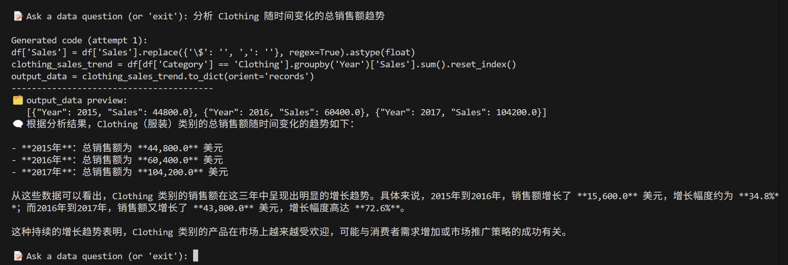

# CSV‑DA

**CSV‑DA (CSV Data‑Analysis assistant)** is a command‑line tool that lets you query any CSV file in *plain language* and receive reliable answers backed by executable Python.

It works by

1. describing the dataset to a Large Language Model (OpenAI GPT‑4o‑mini by default, or any Hugging‑Face chat model(to be implemented));
2. letting the LLM write pandas code;
3. executing that code inside a locked‑down Docker sandbox; and
4. asking the LLM to explain the result in natural language (Chinese by default).

---

**Repo layout**

```text
src/
├─ analysis/           ← data loading, sandbox runner, Docker
│   └─ sandbox/
│   │    ├─ docker/      ← Dockerfile + entry script
│   │       └─ sandbox_entry.py & Dockerfile
│   └─ sandbox_runner.py
├─ history/            ← chat history & logger
├─ llm/                ← model wrapper + prompt builders
├─ config.py           ← runtime settings (env‑driven)
├─ main.py             ← CLI entry point
└─ __init__.py    

Makefile               ← `make docker` builds sandbox image
requirements.txt       ← python env
```

---

**Quick Start**

```bash
cd CSV_DA
```

```bash
# install the package
pip install -r requirements.txt
```
```bash
# export your openai api key first
export OPENAI_API_KEY=""

# build the sandbox image
make docker

# run the CLI
python -m src.main
```

**Steps**
*step1: enter the csv file that you want to analyze*<br>


*step2: enter the question about the data and get your answer!*

